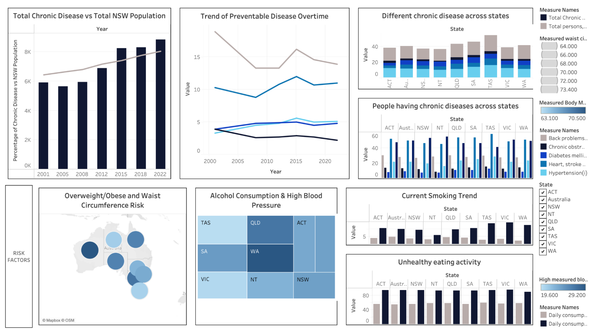

# Analysis of Chronic Diseases in NSW

Welcome to the repository for my "Analysis of Chronic Diseases in NSW" project, prepared as part of the BUSA8031 – Business Analytics Project. This work represents an in-depth exploration of preventable chronic diseases across New South Wales (NSW), focusing on their causes, trends, and regional disparities, with actionable recommendations for improving public health outcomes.

---

## Project Overview

### Client
NSW Health (Agency for Clinical Innovation)

### Objective
The aim of this project is to analyze chronic disease trends, understand contributing factors such as lifestyle and socioeconomic disparities, and propose evidence-based strategies to address these health challenges in NSW.

### Key Focus Areas

#### Primary Risk Factors
- Obesity  
- Smoking and Vaping  
- Poor Diet  
- Insufficient Physical Activity  
- Alcohol Consumption  

#### Demographic and Regional Disparities
- Gender and Age Differences  
- Socioeconomic and Geographic Variability  

#### Healthcare System Insights
- Utilization of Primary Care Services  
- Regional Disparities in Access  
- Government Interventions and Their Impact  

---

## Methodology

### Data Sources
I collected data from:
- Australian Health Performance Framework (AHPF)  
- HealthStats NSW  
- Australian Institute of Health and Welfare (AIHW)  

### Tools and Techniques
- Data Processing: Python, RStudio for statistical analysis and data cleaning.  
- Visualization: Tableau to create interactive dashboards.  
- Documentation: Confluence for project management and collaboration.  

### Analytical Approach
- Segmenting data by demographics (age, gender) and geography to uncover disparities.  
- Leveraging dashboards for a clear visual representation of chronic disease patterns.  
- Answering non-trivial questions about preventable diseases, including their causes and socioeconomic impacts.  

---

## Key Findings and Recommendations

### Findings
- Disparities in Chronic Diseases: Regional and socioeconomic inequalities in health outcomes are significant, with rural and low-SES areas most affected.  
- Lifestyle Factors: Rising trends in vaping and alcohol consumption counteract progress in reducing smoking-related health risks.  
- At-Risk Demographics: Men aged 65–74 show disproportionately high rates of cardiovascular disease.  

### Recommendations
- Healthcare Access: Expand telehealth and mobile clinic services to underserved regions.  
- Public Health Campaigns: Promote healthy eating, physical activity, and responsible alcohol use through targeted awareness efforts.  
- Policy Interventions: Address vaping trends and strengthen support for preventive care initiatives.  

---

## Typical Dashboards

### Overview of Chronic Disease across different states

### Risk Factors – Smoking & Vaping

### Risk Factors – Fruit & Vegetable Intake

### Disparities in Healthcare System

---

## My Role

As a member of this project team, I took a lead role in:
- Data Analysis: Cleaning, processing, and analyzing the data to identify trends and disparities.  
- Dashboard Development: Designing interactive visualizations to present key findings.  
- Report Writing: Drafting detailed sections on lifestyle risk factors, regional disparities, and healthcare system utilization.  

---

## File Structure

- Report.pdf: Comprehensive report including methodology, findings, and recommendations.  
- Appendices: Additional visualizations and dashboards.  

---

## Purpose

This project aims to provide actionable insights for policymakers and health practitioners to mitigate chronic disease prevalence and improve health equity in NSW. The findings emphasize the importance of targeted interventions in achieving better health outcomes across diverse communities.

---

## License

This project is my original work, completed for academic purposes. For inquiries or collaborations, feel free to contact me.
